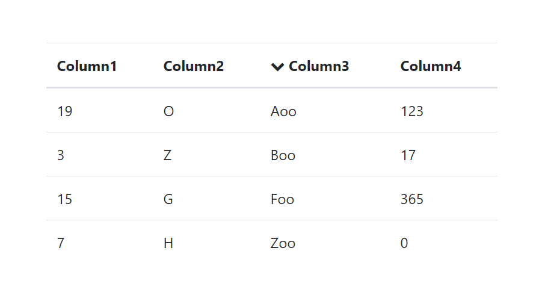

# sortable-table
Simple sortable table component with Vue.js



Use
```
<sortable-table :columns="columns" :rows="rows"></sortable-table>
```

Takes two props:
- columns: Array of objects specifying the name of column and it's data type. Supported data types: 'Integer', 'String'. Example:
```
let columns = [
  {name: 'Column1', type: 'Integer'}
  {name: 'Column2', type: 'String'}
];
```
- rows: Array of arrays where each array represents a row.
```
let rows = [
  [1,2],
  ['foo', 'bar']
];
```
